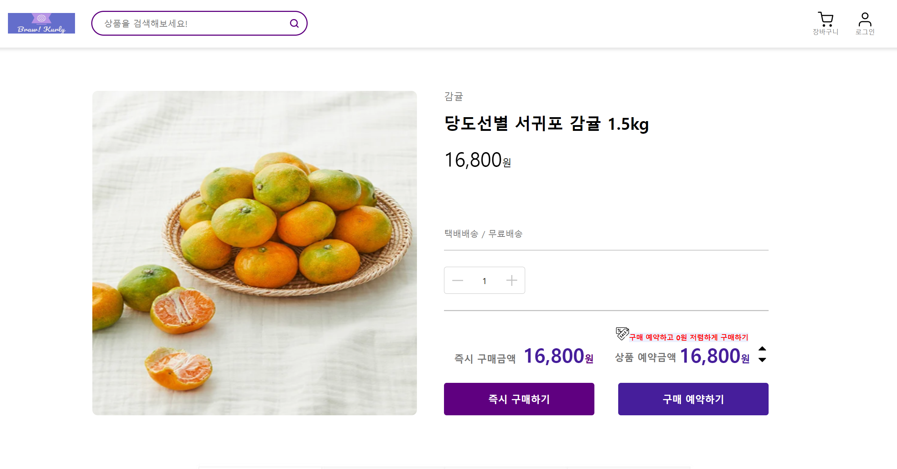
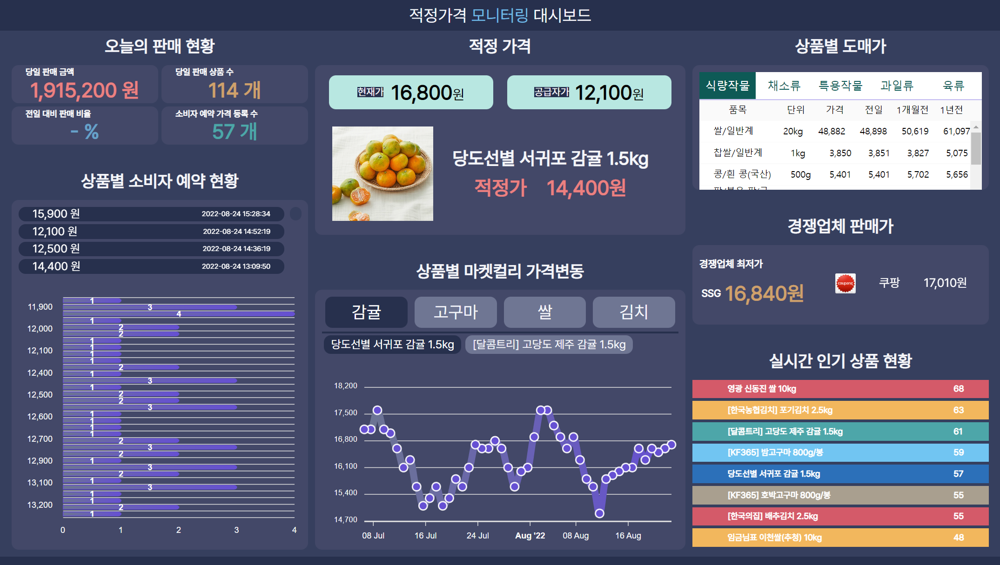

# Client

Moneytoring프로젝트의 client repository입니다.


## Getting Started

#### Prerequisites

+ node > v16.16


## Customer

**실행**

/client/customer

```bash
$ npm install
$ npm start
```


**1. 고객이 사이트에 들어왔을 때 볼 수 있는 화면입니다.**

+ 상품을 클릭하여 상세 페이지로 갈 수 있습니다


**2. 상품을 클릭했을 때 확 들어온 상세페이지입니다**

+ 즉시 구매하기 버튼을 클릭하여 직접 구매 할 수 있습니다
+ 구매 예약을 통해서 원하는 가격이 됐을 때 구매할 수 있도록 유도 할 수 있습니다




## Admin

모니터링 관계자가 실시간으로 정보를 확인 할 수 있습니다.

실행

/client/admin

```bash
$ npm install
$ npm start
```


**1. 모니터링 페이지에서 모든 정보를 한페이지로 확인 할 수 있습니다** 

+ 오늘의 판매현황 / 예약현황 / 적정가격 / 가격변동 / 도매가 / 판매가를 확인 할 수 있습니다



